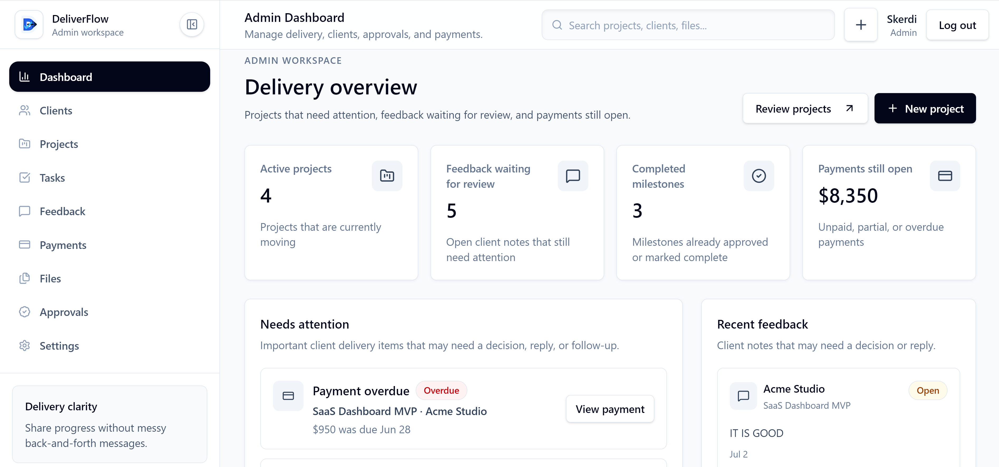
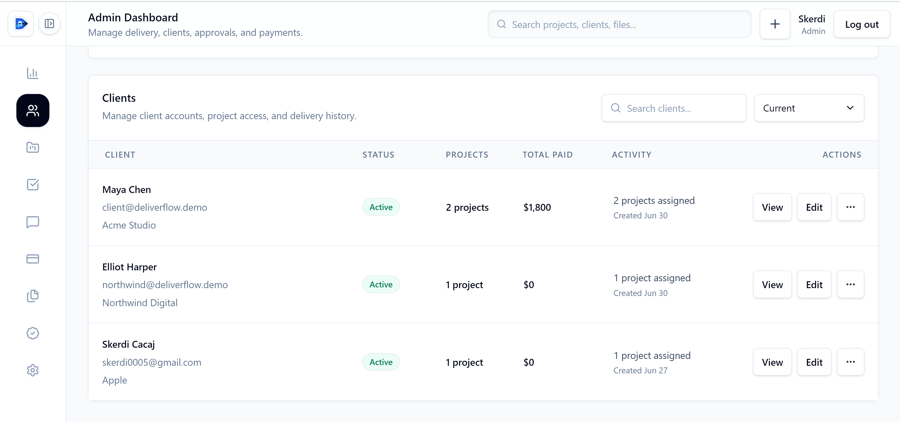
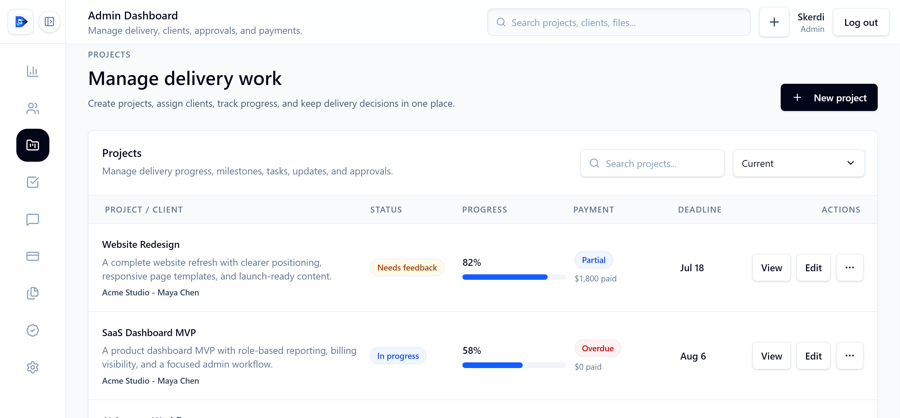
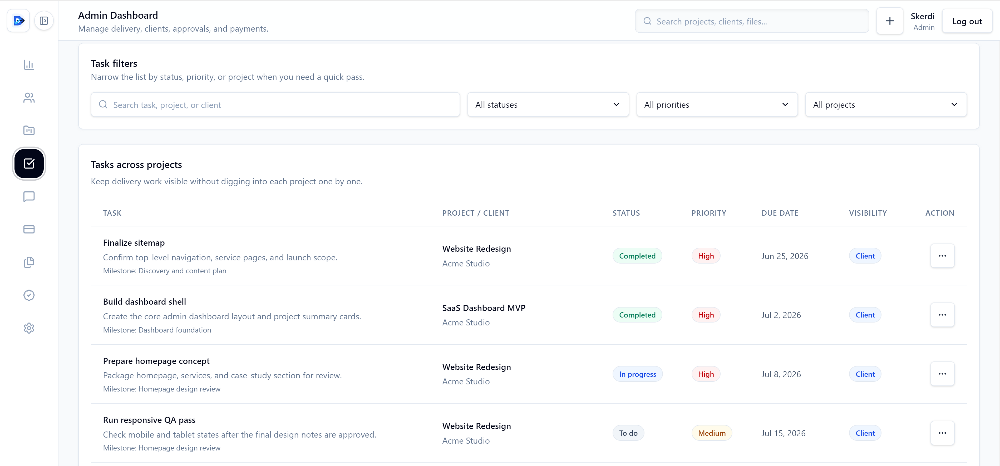
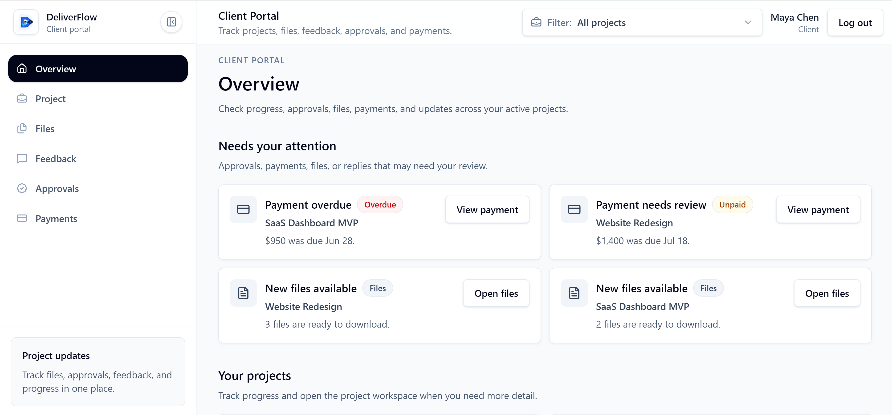

# DeliverFlow

**DeliverFlow** is a production-style client delivery portal built with **Next.js**, **React**, **TypeScript**, **Supabase Auth**, **Supabase Storage**, **Supabase Postgres**, **Drizzle ORM**, **Tailwind CSS**, and **shadcn/ui**.

It helps freelancers and small agencies manage clients, projects, tasks, files, payments, feedback, and approvals from one clean dashboard with a private client portal.

[Live Demo](https://deliver-flow.vercel.app) | [Repository](https://github.com/skerdiD/deliver-flow)

---

## Preview

Explore the deployed app: [deliver-flow.vercel.app](https://deliver-flow.vercel.app)

## Screenshots

### Admin dashboard
Main workspace overview for tracking delivery progress, approvals, feedback, and payments.



### Client management
Manage client accounts, project access, and delivery history.



### Project management
Track projects, progress, payment status, deadlines, and client assignments.



### Task tracking
Manage project tasks by status, priority, due date, and visibility.



### Client portal
Client-facing workspace for project updates, files, feedback, approvals, and payments.



## Overview

Most freelance delivery workflows are scattered across email, chat, Google Drive, invoices, and task tools.

DeliverFlow was built to feel closer to a real client delivery product where admins can manage projects, share files, track payments, collect feedback, and request approvals while clients get one private place to follow the work.

The goal was to show more than CRUD: role-based access, project-scoped client visibility, private file handling, approval workflows, feedback review, server-side authorization, and production-minded full-stack engineering.

---

## Business Value

DeliverFlow helps freelancers and agencies look more professional by giving clients one organized place to follow project delivery.

For clients, it reduces confusion around files, payments, progress, feedback, and approvals.

For service providers, it keeps delivery records organized, protects project scope, and creates a clearer workflow from project start to final handoff.

---

## Key Features

### Auth and Roles

* Supabase email/password authentication
* Admin and client role support
* Protected admin and client route groups
* Role-based redirects after login
* Server-side role checks in protected layouts
* Invite-based client access flow

### Admin Dashboard

* View delivery overview
* Track active projects
* Monitor pending approvals
* Review client feedback
* See outstanding payments
* Follow recent delivery activity

### Clients and Projects

* Create and manage clients
* Store client contact details and notes
* Create and edit projects
* Assign projects to clients
* Track project status, progress, and deadlines
* Connect tasks, files, payments, feedback, and approvals to projects

### Tasks and Milestones

* Add project tasks
* Set task priority and due dates
* Track task status
* Control client-visible delivery items
* Organize work around project progress and milestones

### Files

* Upload project files
* Store files in Supabase Storage
* Keep project files private
* Generate protected signed downloads
* Restrict client access to assigned project files
* Show file metadata such as name, type, size, and upload date

### Payments

* Create manual payment records
* Track unpaid, partial, paid, and overdue payments
* Add due dates and notes
* Mark payments as paid when handled elsewhere
* Show payment status to both admin and assigned client

### Feedback and Approvals

* Clients can submit project feedback
* Admins can review and resolve feedback
* Admins can request client approvals
* Clients can approve or request changes
* Approval records stay connected to projects and milestones
* Status tracking keeps delivery decisions clear

### Client Portal

* Client-only dashboard
* View assigned projects
* Track project progress
* Download shared files
* Review payment status
* Submit feedback
* Respond to approval requests

### Security and Quality

* Protected server actions
* Server-side authorization checks
* Project-scoped client data access
* Private file handling with signed URLs
* Supabase RLS and storage policy hardening
* Zod validation for forms and mutations
* Arcjet protection
* Sentry monitoring support
* Unit and end-to-end testing
* Responsive SaaS-style interface

---

## Tech Stack

### Frontend

* Next.js App Router
* React
* TypeScript
* Tailwind CSS
* shadcn/ui
* Radix UI
* Lucide React
* Recharts
* TanStack Table
* Sonner
* React Hook Form
* Zod

### Backend and Database

* Next.js Server Actions
* Next.js API Routes
* Supabase Auth
* Supabase Storage
* Supabase Postgres
* Drizzle ORM
* Typed database schema
* Project assignment permissions
* Protected file download flow

### Tooling

* Arcjet
* Sentry
* Vitest
* Playwright
* ESLint
* Prettier
* TypeScript compiler
* Drizzle Kit
* GitHub Actions
* Vercel

---

## Architecture

```txt
Client UI
  |-- Next.js App Router / React / Tailwind / shadcn UI
  |-- Landing / Login / Admin Dashboard / Client Portal

Auth and Role Layer
  |-- Supabase Authentication
  |-- Admin and Client Roles
  |-- Protected Routes
  |-- Role-Based Redirects

Server Layer
  |-- Server Actions / API Routes / Zod Validation
  |-- Role Checks / Project Assignment Checks
  |-- Arcjet Protection / Sentry Logging

Database Layer
  |-- Supabase Postgres / Drizzle ORM
  |-- Profiles / Clients / Projects / Tasks / Payments

Delivery Workflow Layer
  |-- Files / Feedback / Approvals / Milestones
  |-- Client Visibility / Project Activity / Signed Downloads
```

Client access is controlled through project assignments, protected routes, and server-side permission checks. Project files are stored in a private Supabase Storage bucket and downloaded through signed URLs after authorization.

---

## Security Model

DeliverFlow uses server-side authorization with Supabase RLS and storage policy hardening.

* Next.js middleware redirects users away from the wrong route group
* Admin and client layouts call `requireRole()` on the server
* Server Actions and Route Handlers re-check role or project assignment
* Client-facing queries are scoped to assigned projects
* Project files use the private `project-files` bucket
* Signed URLs are generated only after permission checks
* Service role keys and database URLs stay server-only
* `NEXT_PUBLIC_*` variables are limited to browser-safe public values

RLS and storage policies are included in:

```txt
supabase/migrations/0001_security_rls_storage.sql
supabase/migrations/0002_activity_invitation_rls.sql
```

See the full security documentation:

```txt
docs/security.md
```

---

## Getting Started

### 1. Clone the repository

```bash
git clone https://github.com/skerdiD/deliver-flow.git
cd deliver-flow
```

### 2. Install dependencies

```bash
npm install
```

### 3. Create environment variables

Create a `.env.local` file in the project root:

```env
NEXT_PUBLIC_SUPABASE_URL=
NEXT_PUBLIC_SUPABASE_ANON_KEY=
SUPABASE_SERVICE_ROLE_KEY=
SUPABASE_STORAGE_BUCKET=project-files
DATABASE_URL=
DIRECT_URL=
ARCJET_KEY=
NEXT_PUBLIC_SENTRY_DSN=
SENTRY_AUTH_TOKEN=
```

Keep `SUPABASE_SERVICE_ROLE_KEY`, `DATABASE_URL`, `DIRECT_URL`, and `SENTRY_AUTH_TOKEN` server-only. Never expose them as `NEXT_PUBLIC_` variables.

### 4. Run database setup

```bash
npm run db:generate
npm run db:migrate
npm run db:seed
```

### 5. Verify Supabase setup

Make sure the private Storage bucket exists:

```txt
project-files
```

Then verify the RLS and storage policy migrations are applied in Supabase.

### 6. Start the development server

```bash
npm run dev
```

Open the app at:

```txt
http://localhost:3000
```

## Author

Built by **skerdiD**.

GitHub: [@skerdiD](https://github.com/skerdiD)
