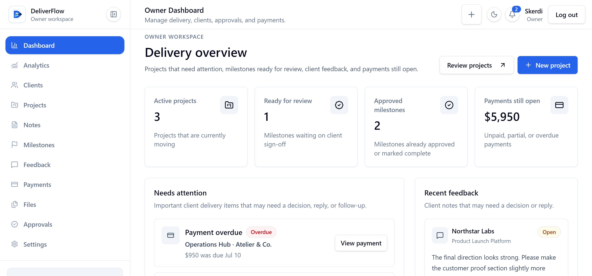
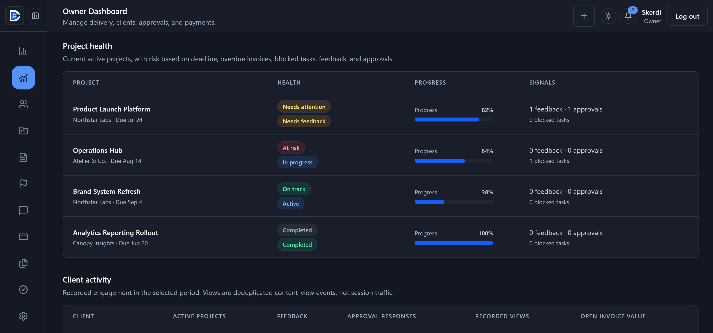
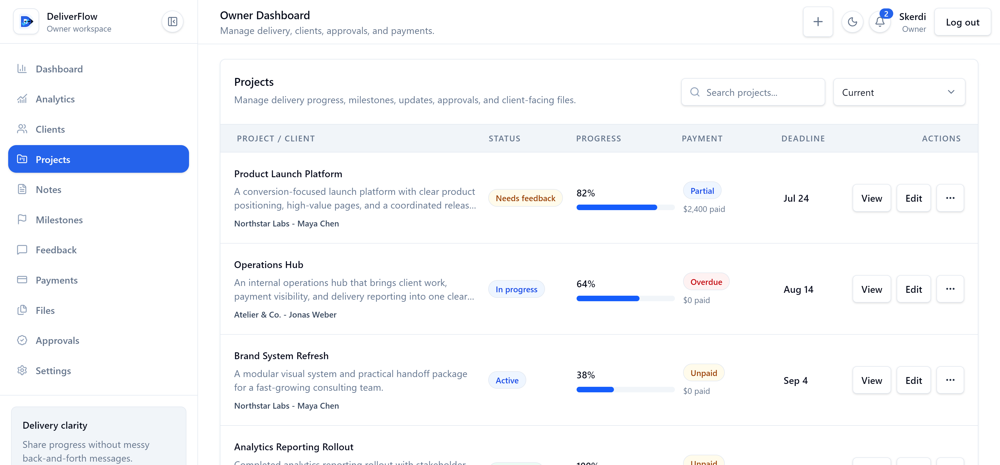
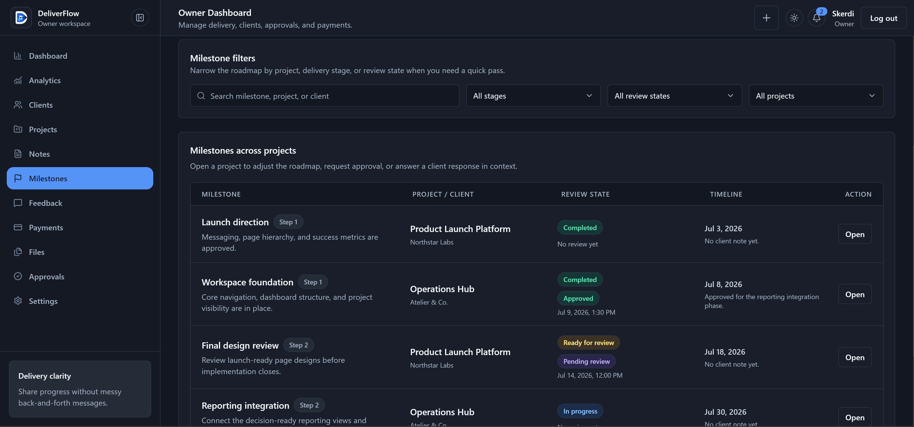
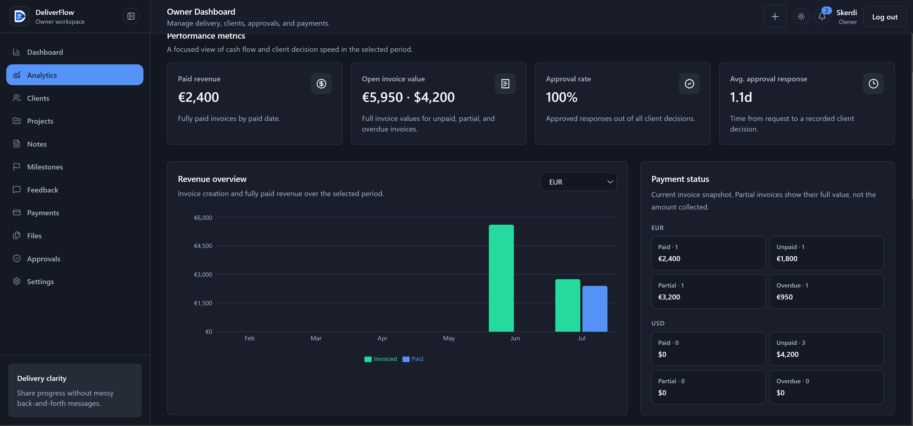
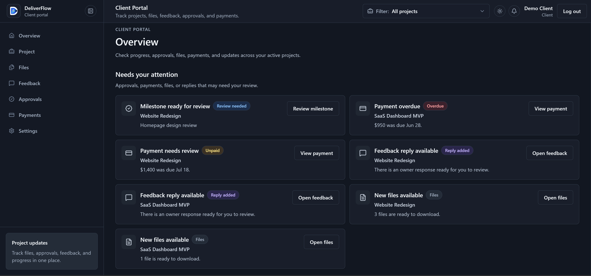
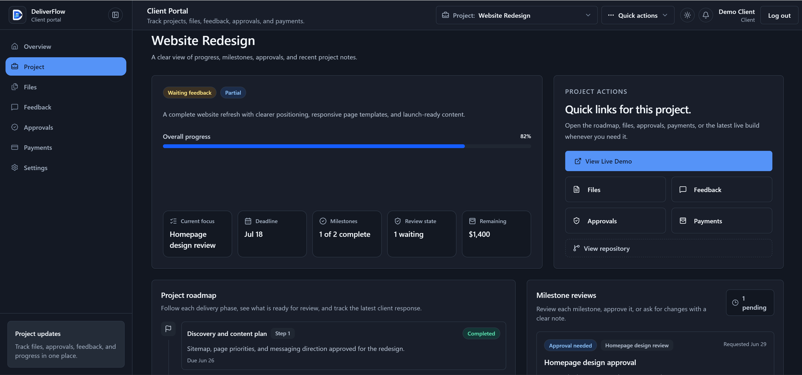
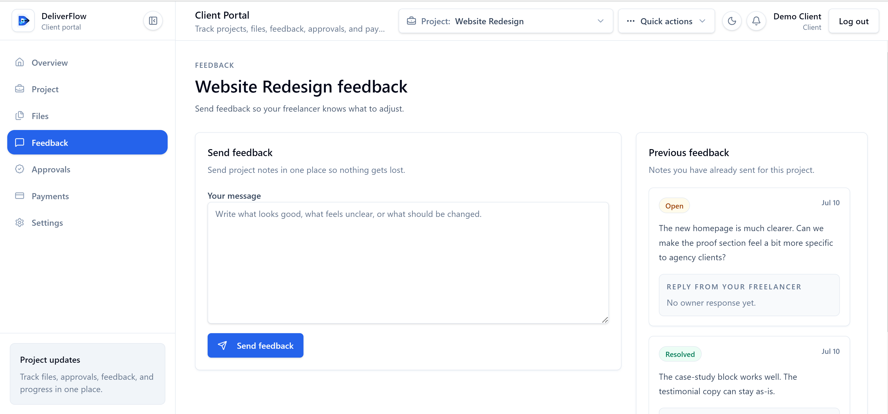

# DeliverFlow

**DeliverFlow** is a production-style client delivery portal for freelancers and small agencies.

It replaces scattered delivery work across email, chat, cloud storage, spreadsheets, and task tools with one organized system for managing clients, projects, tasks, milestones, updates, files, payments, feedback, and approvals.

Owners work from a private delivery dashboard, while each client gets a secure portal that only shows the projects and information assigned to them.

Built with **Next.js**, **React**, **TypeScript**, **Supabase Auth**, **Supabase Postgres**, **Supabase Storage**, **Drizzle ORM**, **Tailwind CSS**, and **shadcn/ui**.

[Live Demo](https://deliver-flow.vercel.app) | [Repository](https://github.com/skerdiD/deliver-flow)

---

## The Problem It Solves

Freelancers and small agencies often manage client delivery across several disconnected tools:

- Tasks and deadlines in one application
- Files in cloud storage
- Feedback and approvals in email or chat
- Payment records in spreadsheets
- Progress updates sent manually

This makes it difficult for the service provider to stay organized and for the client to understand what is finished, what needs attention, where the latest files are, and what remains unpaid.

DeliverFlow brings the full delivery workflow into one place:

```txt
Client -> Project -> Tasks and Milestones -> Updates and Files
       -> Feedback and Approvals -> Payment Tracking -> Final Handoff
```

---

## Product Areas

### Owner Workspace

A private workspace for managing client delivery, monitoring project health, reviewing activity, and handling work that requires attention.

### Client Portal

A project-scoped portal where clients can follow progress, access files, review payments, submit feedback, and respond to approval requests.

### Public Experience

A responsive marketing landing page, public owner signup, invitation-based client onboarding, and quick owner/client demo access.

---

## Demo Access

Live demo: [https://deliver-flow.vercel.app](https://deliver-flow.vercel.app)

The `/login` page includes two demo modes:

- **Owner demo** opens a populated delivery workspace.
- **Client demo** opens a private portal with assigned project data.

Creating an account through `/signup` creates a new workspace and makes that user its owner. Clients are added or invited by an owner rather than signing up publicly.

---

## Preview

### Owner Dashboard

High-level delivery overview with active projects, approvals, feedback, and payment visibility.



### Owner Project Health

Portfolio-level health signals, project progress, and client activity in dark mode.



### Owner Projects

Project delivery list with statuses, progress, payments, deadlines, and actions.



### Owner Milestones

Cross-project milestone tracking with delivery stages, review states, and timelines.



### Owner Analytics

Revenue, payment status, and approval performance analytics for the workspace.



### Client Overview

Client attention queue for approvals, files, feedback, and payment updates.



### Client Project Details

Project progress, milestones, quick actions, and delivery context for a client.



### Client Feedback

Dedicated client feedback workspace with previous feedback and owner responses.



---

## Core Features

### Owner Dashboard and Analytics

- Workspace-scoped delivery dashboard
- Active project and deadline tracking
- Pending approvals and recent feedback
- Attention queue for items requiring action
- Open and overdue payment visibility
- Currency-aware payment totals
- Workspace-scoped analytics for delivery and payment performance
- Responsive SaaS-style navigation and layouts

### Clients, Projects, and Tasks

- Create and manage clients
- Store contact details and internal notes
- Create, edit, and archive projects
- Assign projects to specific clients
- Track status, progress, deadlines, and delivery ownership
- Create and manage project tasks
- Organize project notes and delivery context
- Track milestones and completion state
- Publish project updates for clients
- Maintain project activity and delivery history

### Files and Deliverables

- Upload files to Supabase Storage
- Private project file storage
- Permission-checked signed downloads
- Client access restricted to assigned projects
- File metadata including name, type, size, and upload date
- Scan-aware visibility before files are exposed to clients
- Cleanup recovery jobs for failed storage deletion

### Payments

- Create manual payment records
- Track unpaid, partial, paid, and overdue states
- Add due dates and payment notes
- Mark payments as completed when handled externally
- Show payment information to the assigned client
- Aggregate totals by currency to avoid mixing monetary values
- Automated due and overdue payment reminders

### Feedback and Approvals

- Clients can submit project feedback
- Owners can review and resolve feedback
- Owners can create approval requests
- Approvals can be connected to projects and milestones
- Clients can approve work or request changes
- Server-side checks protect approval responses from unauthorized access

### In-App Notifications

- Notification bell in both owner and client layouts
- Dedicated notification center for each role
- Unread badge and recent-notification dropdown
- Relative timestamps and read-state controls
- Notifications for project updates, files, feedback, approvals, and payments
- Recipient and workspace-scoped notification queries
- Idempotent payment reminder generation
- Protected internal reminder route with Vercel Cron support

### Settings and Account Management

- Owner workspace settings
- Client portal settings
- Basic client account details
- Role-aware settings routes
- Server-side protection for private settings pages

### Authentication and Invitations

- Supabase email/password authentication
- Owner and client roles
- Protected owner and client route groups
- Role-based redirects after login
- Server-side role checks in protected layouts
- Invitation-based client onboarding
- Public signup creates an isolated owner workspace

---

## Security Model

DeliverFlow applies authorization at the route, server, database, and storage layers instead of relying on hidden frontend controls.

### Access Control

- Middleware protects private route groups
- Protected layouts verify authentication and role on the server
- Server Actions and Route Handlers repeat authorization checks
- Client access is checked against project assignments
- Workspace-scoped queries prevent cross-workspace data access
- Supabase Row Level Security adds database-level isolation
- Notifications are limited to the authenticated recipient and workspace

### File Security

- Files are stored in a private Supabase bucket
- Signed download URLs are generated only after authorization
- Signed URLs expire after a short period (`120` seconds by default)
- Upload size is limited (`25 MB` by default)
- MIME type, extension, and file signature are validated server-side
- Dangerous executable, script, HTML, and installer types are blocked
- Storage keys use randomized UUID-based paths
- Original filenames are stored as metadata rather than object keys
- Workspace storage quota defaults to `1 GB`
- Files can remain quarantined until a trusted scanner marks them clean
- Scanner webhook requests are validated before scan state is changed

### Application Protection

- Zod validates forms, mutations, and API input
- Arcjet provides application protection and rate-limiting support
- Sentry provides production monitoring and error reporting
- Sensitive service-role keys and database URLs remain server-only
- Unit, integration, and end-to-end tests cover critical workflows

Detailed security documentation is available in [`docs/security.md`](./docs/security.md).

---

## Architecture

```txt
Browser
  |-- Public landing page, authentication, owner workspace, client portal
  |-- React, Tailwind CSS, shadcn/ui, TanStack Table, Recharts

Next.js Application Layer
  |-- App Router, Server Components, Server Actions, Route Handlers
  |-- Zod validation, role checks, project-assignment checks
  |-- Arcjet protection and Sentry monitoring

Supabase Platform
  |-- Authentication
  |-- PostgreSQL with Row Level Security
  |-- Private Storage with signed URLs and storage policies

Data Layer
  |-- Drizzle ORM and typed schema
  |-- Workspaces, profiles, clients, projects, assignments, and tasks
  |-- Notes, milestones, updates, files, payments, and notifications
  |-- Feedback, approvals, activity records, and cleanup jobs
```

---

## Tech Stack

| Area | Technologies |
| --- | --- |
| Frontend | Next.js App Router, React, TypeScript, Tailwind CSS, shadcn/ui, Radix UI |
| Forms and UI | React Hook Form, Zod, TanStack Table, Recharts, Lucide React |
| Backend | Next.js Server Actions and Route Handlers |
| Data | Supabase Postgres, Drizzle ORM |
| Authentication and Storage | Supabase Auth, Supabase Storage |
| Security and Monitoring | Supabase RLS, Arcjet, Sentry |
| Testing and Delivery | Vitest, Playwright, ESLint, Prettier, GitHub Actions, Vercel |

---

## Getting Started

### 1. Clone and Install

```bash
git clone https://github.com/skerdiD/deliver-flow.git
cd deliver-flow
npm install
```

### 2. Configure Environment Variables

Copy the example environment file and provide your Supabase, database, security, monitoring, demo, and test credentials:

```bash
cp .env.example .env.local
```

Never expose `SUPABASE_SERVICE_ROLE_KEY`, `DATABASE_URL`, `DIRECT_URL`, scanner secrets, cron secrets, or `SENTRY_AUTH_TOKEN` to the browser.

### 3. Prepare the Database

```bash
npm run db:generate
npm run db:migrate
npm run db:seed
```

Apply the Supabase RLS and storage policies from `supabase/migrations/` when setting up a new Supabase project.

### 4. Start Development

```bash
npm run dev
```

Open [http://localhost:3000](http://localhost:3000).

---

## Quality Checks

```bash
npm run lint
npm run typecheck
npm run test
npm run test:e2e
npm run build
```

The GitHub Actions workflow runs the main quality checks for repository changes.

---

## Current Product Boundaries

- Payments are tracked inside DeliverFlow but processed externally; no payment gateway is included.
- The secure file workflow includes a scanner integration point, but a third-party malware scanner must be connected for production quarantine scanning.
- Notifications are server-rendered and action-driven rather than websocket-based realtime events.

These boundaries keep the project focused on secure client delivery rather than becoming a full agency operating system.

---

## Author

Built by **Skerdi**.

GitHub: [@skerdiD](https://github.com/skerdiD)
