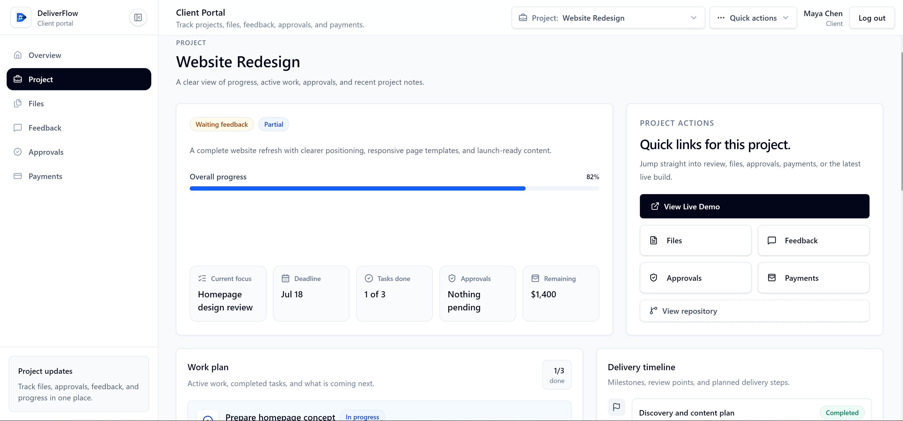

# DeliverFlow

**DeliverFlow** is a full-stack client delivery portal for freelancers and small agencies.

It helps service providers manage clients, projects, notes, milestones, files, payments, feedback, and approvals from one clean Owner workspace, while clients get a private portal to follow project progress and respond to delivery requests.

Built with **Next.js**, **React**, **TypeScript**, **Supabase Auth**, **Supabase Postgres**, **Supabase Storage**, **Drizzle ORM**, **Tailwind CSS**, and **shadcn/ui**.

[Live Demo](https://deliver-flow.vercel.app) | [Repository](https://github.com/skerdiD/deliver-flow)

---

## Preview

DeliverFlow has two main sides:

- **Owner workspace** for managing client delivery
- **Client portal** for project updates, files, feedback, payments, and approvals

---

## Demo Access

Live demo: [https://deliver-flow.vercel.app](https://deliver-flow.vercel.app)

The `/login` page includes two demo modes:

- **Owner demo** opens a populated workspace owner dashboard for managing clients, projects, files, payments, feedback, and approvals.
- **Client demo** opens the client portal with assigned projects, shared files, payment records, feedback, and approvals.

Public signup is separate from demo access. Creating an account on `/signup` starts a new DeliverFlow workspace and makes that user the workspace owner. Clients do not sign up publicly; they are added or invited by the project owner.

---

## Screenshots

### Owner Dashboard

Main workspace overview for tracking delivery progress, approvals, feedback, and open payments.


### Client management

Manage client accounts, project access, delivery history, and client information.


### Project management

Track client projects, progress, payment status, deadlines, and delivery ownership.


### Client portal

Client-facing workspace for project updates, files, feedback, approvals, and payments.


### Client project details

Project-specific client view for progress, milestones, delivery details, and shared information.



---

## Overview

Most freelance and agency delivery workflows are scattered across email, chat, Google Drive, invoices, spreadsheets, and task tools.

DeliverFlow brings the delivery process into one organized system.

owners can manage clients, create projects, add notes, track milestones, upload files, record payments, collect feedback, and request approvals.

Clients get one private place to follow project progress, download shared files, check payment status, submit feedback, and respond to approval requests.

The goal was to build more than a basic CRUD app. DeliverFlow focuses on role-based access, project-scoped client visibility, private file handling, approval workflows, feedback review, and production-style full-stack engineering.

---

## Business Value

DeliverFlow helps freelancers and small agencies look more professional by giving clients one clear place to follow project delivery.

For clients, it reduces confusion around updates, files, payments, feedback, and approvals.

For service providers, it keeps delivery records organized, protects project scope, and creates a clearer workflow from project start to final handoff.

---

## Key Features

### Authentication and Roles

- Supabase email/password authentication
- Owner and client role support
- Protected Owner and client route groups
- Role-based redirects after login
- Server-side role checks in protected layouts
- Invite-based client access flow

### Owner workspace

- Delivery overview dashboard
- Active project tracking
- Open payment summary
- Pending approval visibility
- Recent feedback review
- Delivery items that need attention
- Clean SaaS-style sidebar navigation

### Clients and Projects

- Create and manage client accounts
- Store client contact details and notes
- Create and edit projects
- Assign projects to clients
- Track project status, progress, deadlines, and payments
- Connect notes, milestones, files, feedback, and approvals to projects

### Notes and Milestones

- Add project notes for delivery context and follow-ups
- Track milestone progress across client projects
- Mark milestones as completed or approved
- Connect milestones to client approval workflows
- Keep project decisions and delivery progress organized

### Files

- Upload project files
- Store files in Supabase Storage
- Keep project files private
- Generate protected signed downloads
- Restrict client access to assigned project files
- Show file metadata such as name, type, size, and upload date

### Payments

- Create manual payment records
- Track unpaid, partial, paid, and overdue payments
- Add due dates and payment notes
- Mark payments as paid when handled elsewhere
- Show payment status to both owner and assigned client

### Notifications

- In-app notification bell for both Owner and client layouts
- Dedicated Owner and client notification pages
- Unread badge, recent dropdown, relative timestamps, and read state controls
- Server-created notifications for project updates, approval requests, client feedback, shared files, due payments, overdue payments, approval acceptance, and change requests
- Idempotent payment reminder scheduling with a protected internal route and Vercel cron support

### Feedback and Approvals

- Clients can submit project feedback
- owners can review and resolve feedback
- owners can request client approvals
- Clients can approve or request changes
- Approval records stay connected to projects and milestones

### Client Portal

- Client-only dashboard
- View assigned projects
- Track project progress and milestones
- Download shared files
- Review payment status
- Submit feedback
- Respond to approval requests

### Security and Quality

- Protected server actions
- Server-side authorization checks
- Project-scoped client data access
- Private file handling with signed URLs
- Supabase RLS and storage policy hardening
- Zod validation for forms and mutations
- Arcjet protection
- Sentry monitoring support
- Unit and end-to-end testing
- Responsive SaaS-style interface

---

## Tech Stack

### Frontend

- Next.js App Router
- React
- TypeScript
- Tailwind CSS
- shadcn/ui
- Radix UI
- Lucide React
- Recharts
- TanStack Table
- React Hook Form
- Zod

### Backend and Database

- Next.js Server Actions
- Next.js API Routes
- Supabase Auth
- Supabase Storage
- Supabase Postgres
- Drizzle ORM
- Typed database schema
- Project assignment permissions
- Protected file download flow

### Tooling

- Arcjet
- Sentry
- Vitest
- Playwright
- ESLint
- Prettier
- Drizzle Kit
- GitHub Actions
- Vercel

---

## Architecture

```txt
Client UI
  |-- Next.js App Router / React / Tailwind / shadcn UI
  |-- Login / Owner workspace / Client Portal

Auth and Role Layer
  |-- Supabase Authentication
  |-- Owner and client Roles
  |-- Protected Routes
  |-- Role-Based Redirects

Server Layer
  |-- Server Actions / API Routes
  |-- Zod Validation
  |-- Role Checks / Project Assignment Checks
  |-- Arcjet Protection / Sentry Logging

Database Layer
  |-- Supabase Postgres / Drizzle ORM
  |-- Profiles / Clients / Projects
  |-- Notes / Milestones / Files / Payments
  |-- Feedback / Approvals / Activity
```

Client access is controlled through project assignments, protected routes, and server-side permission checks.

Project files are stored in a private Supabase Storage bucket and downloaded through signed URLs only after authorization.

---

## Security Model

DeliverFlow uses server-side authorization with Supabase RLS and storage policy hardening.

- Middleware redirects users away from the wrong route group
- Owner and client layouts check user roles on the server
- Server Actions and Route Handlers re-check role or project assignment
- Client-facing queries are scoped to assigned projects
- Project files use a private Supabase Storage bucket
- Signed URLs are generated only after permission checks
- Uploads use server-side MIME, extension, signature, quota, and scan-state checks
- Client-visible files must be both assigned and scan-clean
- Notifications are scoped to the authenticated recipient and workspace only
- Service role keys and database URLs stay server-only
- `NEXT_PUBLIC_*` variables are limited to browser-safe public values

RLS and storage policies are included in:

```txt
supabase/migrations/0001_security_rls_storage.sql
supabase/migrations/0002_activity_invitation_rls.sql
supabase/migrations/0003_workspace_rls.sql
supabase/migrations/0005_file_security_hardening.sql
supabase/migrations/0006_notifications_rls.sql
```

Full security documentation:

```txt
docs/security.md
```

### File Security Controls

- Maximum single upload size defaults to `25 MB`
- Signed download URLs default to `120` seconds and are generated server-side only
- Workspace storage quota defaults to `1 GB`
- Allowed file types: `PDF`, `PNG`, `JPG`, `JPEG`, `GIF`, `WEBP`, `DOCX`, `XLSX`, `CSV`, `TXT`, and `ZIP`
- Dangerous executable, script, HTML, and installer extensions are blocked
- Storage keys are randomized under `workspaces/{workspaceId}/projects/{projectId}/{uuid}/file.ext`
- Original file names are kept as metadata only and never used as permanent object keys
- New uploads start in scan-aware flow:
  - `development-noop` mode marks files clean immediately for local work
  - `quarantine` mode keeps files pending until a trusted scanner calls the internal webhook
- Failed storage cleanup is recorded in `project_file_cleanup_jobs` for later recovery

Known limitation: DeliverFlow includes a production integration point for malware scanning, but it does not ship with a real third-party scanner. In production, do not mark files clean automatically unless your scanner webhook is wired up.

### Notifications

- Supported notification events:
  - `project_update_created`
  - `approval_requested`
  - `feedback_submitted`
  - `project_file_uploaded`
  - `payment_due`
  - `payment_overdue`
  - `approval_accepted`
  - `approval_changes_requested`
- Payment reminders are created by the protected internal route at `/api/internal/notifications/payments`
- `vercel.json` includes a daily cron schedule for that route at `09:00 UTC`
- Manual test example:

```bash
curl -H "Authorization: Bearer $CRON_SECRET" \
  http://localhost:3000/api/internal/notifications/payments
```

Known limitation: the notification center is intentionally server-rendered and action-driven. It refreshes on navigation and mutation results, but it does not use websocket-based realtime delivery yet.

---

## Getting Started

### 1. Clone the repository

```bash
git clone https://github.com/skerdiD/deliver-flow.git
cd deliver-flow
```

### 2. Install dependencies

```bash
npm install
```

### 3. Create environment variables

Create a `.env.local` file in the project root:

```env
NEXT_PUBLIC_SUPABASE_URL=
NEXT_PUBLIC_SUPABASE_ANON_KEY=
SUPABASE_SERVICE_ROLE_KEY=
DATABASE_URL=
DIRECT_URL=
PROJECT_FILE_MAX_UPLOAD_BYTES=26214400
PROJECT_FILE_SIGNED_URL_TTL_SECONDS=120
PROJECT_FILE_WORKSPACE_QUOTA_BYTES=1073741824
PROJECT_FILE_SCAN_MODE=development-noop
PROJECT_FILE_SCAN_WEBHOOK_SECRET=
CRON_SECRET=
NOTIFICATION_PAYMENT_DUE_WINDOW_DAYS=3
DEMO_OWNER_EMAIL=
DEMO_OWNER_PASSWORD=
DEMO_CLIENT_EMAIL=
DEMO_CLIENT_PASSWORD=
ARCJET_KEY=
NEXT_PUBLIC_SENTRY_DSN=
SENTRY_AUTH_TOKEN=
E2E_ADMIN_EMAIL=
E2E_ADMIN_PASSWORD=
E2E_CLIENT_EMAIL=
E2E_CLIENT_PASSWORD=
E2E_UNASSIGNED_CLIENT_EMAIL=
E2E_UNASSIGNED_CLIENT_PASSWORD=
```

Keep `SUPABASE_SERVICE_ROLE_KEY`, `DATABASE_URL`, `DIRECT_URL`, and `SENTRY_AUTH_TOKEN` server-only.

### 4. Run database setup

```bash
npm run db:generate
npm run db:migrate
npm run db:seed
```

If you apply Supabase SQL policies separately from Drizzle migrations, also run the files hardening SQL from:

```txt
supabase/migrations/0005_file_security_hardening.sql
supabase/migrations/0006_notifications_rls.sql
```

### 5. Start the development server

```bash
npm run dev
```

Open:

```txt
http://localhost:3000
```

### Test Commands

```bash
npm run lint
npm run typecheck
npm run test
npm run test -- src/features/notifications src/app/api/internal/notifications/payments/route.test.ts
npm run test:e2e
npm run build
```

---

## Author

Built by **Skerdi**.

GitHub: [@skerdiD](https://github.com/skerdiD)
